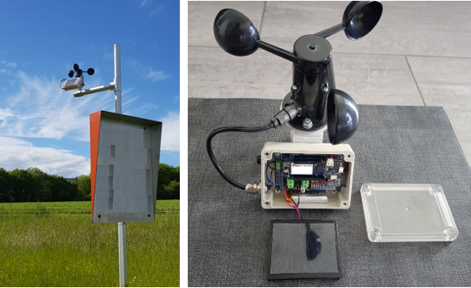

# Wind-monitoring-station

## Description
Autonomous wind monitoring station based on Arduino MKR GSM 1400. All data are pushed to [ThingSpeak](https://thingspeak.com/)

 

The following components are used: 

- Arduino MKR GSM 1400 (MKRGSM1400WANT)
- DFRobot Solar Lipo Charger (DFR0264)
- Solar panel 70x55mm (100mA, 0.5W)
- LiPo 3.7V 1000mAh (102050)
- Nano-Power System Timer With Watchdog Function (TPL5010)
- Taoglas 4G/LTE Flexible antenna (FXUB63.54.0150C)

Integration on website:

## Comments

## Disclaimer

Copyright (C) valcesch

valcesch reserves all rights in this deliverable (documentation, software, etc., hereafter “Deliverable”).

valcesch grants you the right to use, copy, modify and distribute the Deliverable provided hereunder for any purpose without fee.

THIS DELIVERABLE IS BEING PROVIDED "AS IS", WITHOUT ANY EXPRESS OR IMPLIED WARRANTY. IN PARTICULAR, NEITHER THE AUTHOR NOR valcesch MAKES ANY REPRESENTATION OR WARRANTY OF ANY KIND CONCERNING THE MERCHANTABILITY OF THIS DELIVERABLE OR ITS FITNESS FOR ANY PARTICULAR PURPOSE.

In case you provide us a feedback or make a contribution in the form of a further development of the Deliverable (“Contribution”), valcesch will have the same rights as granted to you, namely to use, copy, modify and distribute the Contribution provided to us for any purpose without fee.